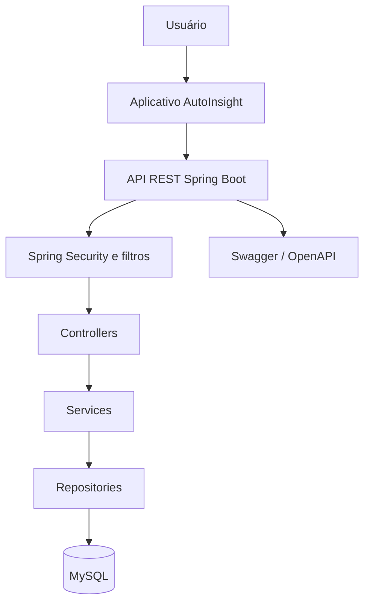
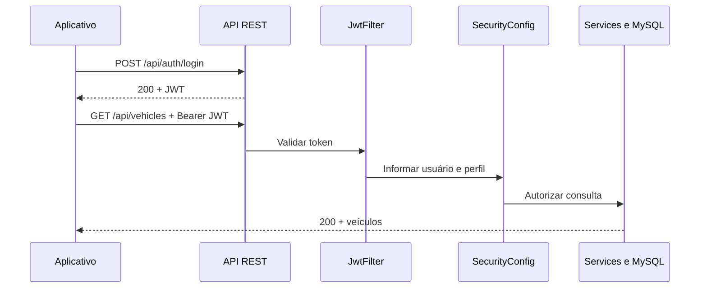
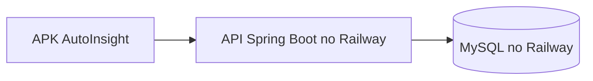

# AutoInsight API — Arquitetura Orientada a Serviços

> Projeto desenvolvido para o Challenge Ford FIAP 2026 — Inteligência Competitiva Automotiva.

---

## Equipe

| Nome | RM |
|---|---|
| Ali Andrea Mamani Molle | 558052 |
| Guilherme Linard F.R Gozzi | 555768 |
| Lucas Vasquez Silva | 555159 |

## Índice

- [Visão geral](#visão-geral)
- [Arquitetura da solução](#arquitetura-da-solução)
- [Autenticação e autorização](#autenticação-e-autorização)
- [Tecnologias](#tecnologias)
- [Estrutura do projeto](#estrutura-do-projeto)
- [Pré-requisitos](#pré-requisitos)
- [Configuração do banco de dados](#configuração-do-banco-de-dados)
- [Variáveis de ambiente](#variáveis-de-ambiente)
- [Como rodar](#como-rodar)
- [Endpoints da API](#endpoints-da-api)
- [Respostas HTTP](#respostas-http)
- [Testes automatizados](#testes-automatizados)
- [Evidências da execução](#evidências-da-execução)
- [Documentação Swagger](#documentação-swagger)
- [Aplicação publicada](#aplicação-publicada)
- [Demonstração do aplicativo](#demonstração-do-aplicativo)

---

## Visão geral

A **AutoInsight API** é uma API REST desenvolvida em **Spring Boot** para consultar e gerenciar informações de inteligência competitiva automotiva. O aplicativo mobile consome a API para pesquisar veículos e suas especificações técnicas.

A solução oferece autenticação por JWT, permissões para os perfis `ANALYST` e `ADMIN`, histórico de buscas, limitação de requisições e logs de auditoria.

---

## Arquitetura da solução



| Componente | Responsabilidade |
|---|---|
| Aplicativo AutoInsight | Enviar requisições e apresentar os resultados ao usuário |
| Controllers | Receber requisições HTTP e devolver respostas |
| Services | Executar as regras de negócio |
| Repositories | Acessar os dados persistidos |
| MySQL | Armazenar veículos, especificações, histórico e auditoria |
| Spring Security e filtros | Validar tokens, aplicar permissões, limitar requisições e registrar acessos |
| Swagger / OpenAPI | Disponibilizar a documentação interativa da API |

A camada de segurança também atende a requisitos da disciplina de **Cybersecurity**, incluindo JWT, controle de acesso por perfis, rate limiting, criptografia AES/GCM e auditoria.

### Fluxo de comunicação e autenticação



No login, a API verifica as credenciais e gera um JWT com usuário, perfil e prazo de expiração. Nas chamadas protegidas, o cliente envia:

```http
Authorization: Bearer <token>
```

O `JwtFilter` valida o token. O `SecurityConfig` verifica se o perfil tem permissão para executar a operação. Uma requisição sem autenticação a um recurso protegido retorna `401`; um usuário autenticado sem permissão recebe `403`.

---

## Autenticação e autorização

O endpoint `POST /api/auth/login` é público. Os demais recursos têm acesso controlado por perfil.

| Operação | ANALYST | ADMIN |
|---|---:|---:|
| Consultar veículos | Sim | Sim |
| Cadastrar, atualizar e excluir veículos | Não | Sim |
| Consultar histórico | Sim | Sim |
| Excluir histórico | Não | Sim |
| Consultar logs de auditoria | Não | Sim |

O JWT é assinado pela API. Sua assinatura e expiração são verificadas nas requisições protegidas. O prazo padrão configurado em desenvolvimento é de **24 horas**.

> Os nomes de usuário são `admin` e `analyst`. As senhas são configuradas pelo responsável pelo ambiente e não são publicadas no repositório.

---

## Tecnologias

| Tecnologia | Versão | Finalidade |
|---|---|---|
| Java | 17 | Linguagem principal |
| Spring Boot | 3.5.14 | Framework da API |
| Spring Security | Gerenciada pelo Spring Boot | Autenticação e autorização |
| Spring Data JPA | Gerenciada pelo Spring Boot | Persistência de dados |
| MySQL | 8.0 | Banco de dados relacional |
| Flyway | Gerenciada pelo Spring Boot | Migrações do banco |
| JJWT | 0.12.6 | Geração e validação de JWT |
| Bucket4j | 7.6.0 | Limitação de requisições |
| Springdoc OpenAPI | 2.8.8 | Documentação Swagger |
| Lombok | Gerenciada pelo Spring Boot | Redução de código repetitivo |
| JUnit e Mockito | Dependências de teste do Spring Boot | Testes automatizados |

---

## Estrutura do projeto

```text
src/main/java/com/autoinsight/autoinsight_api/
├── config/
│   ├── SecurityConfig.java
│   └── SwaggerConfig.java
├── controller/
│   ├── AuthController.java
│   ├── VehicleController.java
│   ├── SearchHistoryController.java
│   └── AuditLogController.java
├── dto/
│   ├── ApiResponseDTO.java
│   ├── LoginRequestDTO.java
│   ├── LoginResponseDTO.java
│   ├── VehicleRequestDTO.java
│   ├── VehicleResponseDTO.java
│   ├── SpecificationRequestDTO.java
│   ├── SpecificationResponseDTO.java
│   └── SearchHistoryResponseDTO.java
├── exception/
│   ├── GlobalExceptionHandler.java
│   ├── VehicleAlreadyExistsException.java
│   └── VehicleNotFoundException.java
├── model/
│   ├── Vehicle.java
│   ├── Specification.java
│   ├── SearchHistory.java
│   └── AuditLog.java
├── repository/
│   ├── VehicleRepository.java
│   ├── SpecificationRepository.java
│   ├── SearchHistoryRepository.java
│   └── AuditLogRepository.java
├── security/
│   ├── JwtUtil.java
│   ├── JwtFilter.java
│   ├── RateLimitFilter.java
│   ├── AuditLogFilter.java
│   └── CryptoUtils.java
└── service/
    ├── VehicleService.java
    └── SearchHistoryService.java

src/main/resources/
├── application.properties
└── db/migration/
    ├── V1__create_tables.sql
    └── V2__create_audit_logs.sql

src/test/java/com/autoinsight/autoinsight_api/
├── controller/
│   ├── AuthControllerTest.java
│   ├── VehicleErrorTest.java
│   └── VehicleSecurityTest.java
├── security/
│   ├── JwtFilterTest.java
│   ├── JwtUtilTest.java
│   └── CryptoUtilsTest.java
└── service/
    └── VehicleServiceTest.java
```

---

## Pré-requisitos

- Java 17 ou superior;
- MySQL Server;
- Maven ou o Maven Wrapper incluído no projeto;
- MySQL Workbench, opcional para administrar o banco.

---

## Configuração do banco de dados

### 1. Instalar e iniciar o MySQL

Instale o MySQL Community Server e defina a senha do usuário que será utilizado pela aplicação.

O MySQL Workbench pode ser usado para criar e consultar o banco, mas não substitui o MySQL Server.

### 2. Criar o banco

No MySQL Workbench, execute:

```sql
CREATE DATABASE autoinsight_db;
```

A URL de conexão da aplicação também contém `createDatabaseIfNotExist=true`. Assim, o banco pode ser criado durante a conexão, desde que o usuário do MySQL tenha permissão. Criá-lo manualmente antes de iniciar a API facilita a conferência da configuração.

O Flyway executa as migrações para criar as tabelas quando a aplicação inicia.

---

## Variáveis de ambiente

O arquivo `src/main/resources/application.properties` lê as seguintes variáveis:

| Variável | Finalidade | Padrão de desenvolvimento |
|---|---|---|
| `DB_URL` | Endereço JDBC do MySQL | `jdbc:mysql://localhost:3306/autoinsight_db?createDatabaseIfNotExist=true&useSSL=false&serverTimezone=UTC` |
| `DB_USERNAME` | Usuário do MySQL | `root` |
| `DB_PASSWORD` | Senha do MySQL | Obrigatória |
| `JWT_SECRET` | Chave de assinatura do JWT | Obrigatória; configure chave forte |
| `JWT_EXPIRATION` | Validade do JWT em milissegundos | `86400000` (24 horas) |
| `CRYPTO_KEY` | Chave de criptografia AES/GCM | Obrigatória; chave AES de 16, 24 ou 32 bytes |
| `ADMIN_PASSWORD` | Senha do usuário `admin` | Obrigatória |
| `ANALYST_PASSWORD` | Senha do usuário `analyst` | Obrigatória |
| `CORS_ALLOWED_ORIGINS` | Origens permitidas no acesso pelo navegador | `http://localhost:3000,http://localhost:8080,http://localhost:8081` |
| `SERVER_FORWARD_HEADERS_STRATEGY` | Reconhecer o HTTPS encaminhado pelo proxy | Não necessária na execução local; no Railway, `framework` |

Para uso local, a API se conecta ao MySQL em `localhost:3306/autoinsight_db`. No Railway, `DB_URL`, `DB_USERNAME` e `DB_PASSWORD` apontam para o serviço MySQL do mesmo projeto pela rede interna. Os valores das senhas e das chaves não devem ser publicados no GitHub.

No Windows PowerShell, configure as variáveis para a sessão atual antes de iniciar a API. Substitua os exemplos por valores próprios; não publique os valores:

```powershell
$env:DB_PASSWORD="SUA_SENHA_DO_MYSQL"
$env:JWT_SECRET="SUA_CHAVE_ALEATORIA_COM_PELO_MENOS_48_BYTES"
$env:CRYPTO_KEY="SUA_CHAVE_AES_DE_16_24_OU_32_BYTES"
$env:ADMIN_PASSWORD="SUA_SENHA_ADMIN"
$env:ANALYST_PASSWORD="SUA_SENHA_ANALYST"
```

Em ambientes que já tenham histórico criptografado, mantenha `CRYPTO_KEY` compatível com os dados antigos até planejar sua migração. Trocar a chave sem migrar os registros impede a leitura do histórico. A troca de `JWT_SECRET` invalida os tokens previamente emitidos.

---

## Como rodar

### 1. Clonar o repositório

```bash
git clone https://github.com/AliAndrea1/Sprint-Soa-Ford.git
cd Sprint-Soa-Ford
```

### 2. Preparar o banco

Inicie o MySQL e configure `DB_PASSWORD`, `JWT_SECRET`, `CRYPTO_KEY`, `ADMIN_PASSWORD` e `ANALYST_PASSWORD` conforme a seção anterior. Ajuste `DB_USERNAME` se necessário.

### 3. Iniciar a API

No Windows, usando o Maven Wrapper:

```powershell
.\mvnw.cmd spring-boot:run
```

Se o Maven estiver instalado e configurado:

```bash
mvn spring-boot:run
```

Por padrão, a API fica disponível em:

```text
http://localhost:8080
```

Na versão publicada, o APK usa a URL HTTPS da API no Railway. Para executar a API localmente com o app, configure uma URL local acessível pelo celular e mantenha os dois dispositivos na mesma rede.

---

## Endpoints da API

### Autenticação

| Método | Endpoint | Descrição | Acesso |
|---|---|---|---|
| POST | `/api/auth/login` | Autentica e retorna um JWT | Público |

**Exemplo de corpo da requisição:**

```json
{
  "username": "analyst",
  "password": "<senha configurada em ANALYST_PASSWORD>"
}
```

**Contas configuradas pelo responsável pelo ambiente:**

| Usuário | Perfil | Origem da senha |
|---|---|---|
| `admin` | `ADMIN` | Variável `ADMIN_PASSWORD` |
| `analyst` | `ANALYST` | Variável `ANALYST_PASSWORD` |

Para obter acesso de demonstração, solicite as credenciais ao responsável pelo projeto.

### Veículos

| Método | Endpoint | Descrição | Acesso |
|---|---|---|---|
| GET | `/api/vehicles` | Lista veículos | ADMIN, ANALYST |
| GET | `/api/vehicles/{id}` | Busca veículo por ID | ADMIN, ANALYST |
| GET | `/api/vehicles/search` | Busca veículo e permite selecionar atributos | ADMIN, ANALYST |
| GET | `/api/vehicles/brand/{brand}` | Lista veículos por marca | ADMIN, ANALYST |
| POST | `/api/vehicles` | Cadastra veículo | ADMIN |
| PUT | `/api/vehicles/{id}` | Atualiza veículo | ADMIN |
| DELETE | `/api/vehicles/{id}` | Exclui veículo | ADMIN |

**Exemplo de busca completa:**

```text
GET /api/vehicles/search?brand=Ford&model=RANGER&version=XLT%203.0L%20V6%20AT
```

**Exemplo solicitando somente alguns atributos:**

```text
GET /api/vehicles/search?brand=Ford&model=RANGER&version=XLT%203.0L%20V6%20AT&attributes=Potência&attributes=Torque
```

Quando um atributo solicitado não está cadastrado para o veículo, a busca retorna `"Não disponível"` para esse atributo.

### Histórico de buscas

| Método | Endpoint | Descrição | Acesso |
|---|---|---|---|
| GET | `/api/history` | Consulta o histórico | ADMIN, ANALYST |
| DELETE | `/api/history/{id}` | Exclui um registro do histórico | ADMIN |

### Auditoria

| Método | Endpoint | Descrição | Acesso |
|---|---|---|---|
| GET | `/api/audit` | Lista os logs de auditoria | ADMIN |
| GET | `/api/audit/user/{username}` | Consulta logs por usuário | ADMIN |

---

## Respostas HTTP

| Status | Situação |
|---|---|
| `200 OK` | Consulta ou atualização concluída |
| `201 Created` | Veículo cadastrado |
| `400 Bad Request` | Requisição com dados inválidos |
| `401 Unauthorized` | Recurso protegido acessado sem autenticação ou login com credenciais inválidas |
| `403 Forbidden` | Usuário autenticado sem permissão |
| `404 Not Found` | Veículo solicitado não encontrado |
| `409 Conflict` | Veículo já cadastrado |
| `429 Too Many Requests` | Limite de requisições excedido |
| `500 Internal Server Error` | Erro inesperado na aplicação |

Os controllers utilizam `ApiResponseDTO` para as respostas da aplicação, com os campos `success`, `message` e `data`. Respostas produzidas diretamente pelo Spring Security podem vir sem corpo.

---

## Testes automatizados

Os testes implementados verificam:

- Seleção de especificações existentes e ausentes;
- Geração, conteúdo, assinatura e expiração do JWT;
- Comportamento do `JwtFilter` com token válido, token inválido e sem token;
- Login com credenciais corretas e incorretas;
- Acesso aos veículos sem token, consulta permitida para `ANALYST` e cadastro proibido para `ANALYST`;
- Respostas `404` para veículo inexistente e `409` para veículo já cadastrado;
- Criptografia e descriptografia do histórico; falhas de criptografia não devolvem dados em texto aberto.

Para executar as sete classes verificadas nesta sprint, na raiz do projeto:

```powershell
.\mvnw.cmd "-Dtest=VehicleServiceTest,JwtFilterTest,JwtUtilTest,AuthControllerTest,VehicleSecurityTest,VehicleErrorTest,CryptoUtilsTest" test
```

As sete classes somaram **19 testes aprovados, sem falhas** na execução local de 27/09/2026. Os testes usam dados e serviços simulados e não dependem de conexão com o MySQL.

> Ao executar todos os testes do projeto com `.\mvnw.cmd test`, um teste de inicialização do contexto Spring já existente pode precisar do MySQL configurado e em execução.

### Evidências da execução

| Teste | Evidência |
|---|---|
| Seleção de especificações | [VehicleServiceTest](docs/evidencias/testes/vehicle-service.JPG) |
| Filtro JWT | [JwtFilterTest](docs/evidencias/testes/jwt-filter.JPG) |
| Geração e validação do JWT | [JwtUtilTest](docs/evidencias/testes/jwt-util.JPG) |
| Login | [AuthControllerTest](docs/evidencias/testes/auth-controller.JPG) |
| Autorização dos veículos | [VehicleSecurityTest](docs/evidencias/testes/vehicle-security.JPG) |
| Erros 404 e 409 | [VehicleErrorTest](docs/evidencias/testes/vehicle-error.JPG) |
| Execução completa — 19 testes | [Resultado geral](docs/evidencias/testes/todos-os-testes.JPG) |
| Criptografia do histórico | [CryptoUtilsTest aprovado](docs/evidencias/testes/crypto-utils.JPG) |
| Pipeline de segurança | [Execuções do GitHub Actions](https://github.com/AliAndrea1/Sprint-Soa-Ford/actions/runs/36296251088) |

---

## Documentação Swagger

Com a API em execução, acesse:

```text
http://localhost:8080/swagger-ui/index.html
```

O projeto também configura o caminho `/swagger-ui.html`.

Para testar um endpoint protegido:

1. Execute `POST /api/auth/login`;
2. Copie o token retornado;
3. Clique em **Authorize** no Swagger;
4. Cole o token no campo de autenticação;
5. Execute o endpoint desejado.

Não inclua tokens em capturas de tela ou arquivos de evidência.


---

## Aplicação publicada

A API e o banco MySQL estão hospedados no Railway. O APK Android utiliza a API publicada por HTTPS e foi testado em um dispositivo físico com dados móveis.

| Recurso | Endereço |
|---|---|
| Swagger / OpenAPI | [Documentação interativa](https://sprint-soa-ford-production.up.railway.app/swagger-ui.html) |
| URL base da API | `https://sprint-soa-ford-production.up.railway.app/api` |
| APK Android | [Página do build no Expo](https://expo.dev/accounts/aliandrea/projects/autoinsight/builds/36dcb7f3-991d-4539-9449-e1fc4ab4d321) |

O endereço `/api` é um prefixo: as chamadas utilizam caminhos como `/api/auth/login` e `/api/vehicles`. A raiz do domínio não apresenta uma página da aplicação.

### Funcionamento no Railway



O aplicativo obtém um JWT no login e envia o token nas requisições protegidas. A API aplica as permissões dos perfis `ADMIN` e `ANALYST`. O serviço da API acessa o MySQL pela rede interna do Railway, usando as variáveis `DB_URL`, `DB_USERNAME` e `DB_PASSWORD`. A variável `SERVER_FORWARD_HEADERS_STRATEGY=framework` permite que o Swagger gere URLs HTTPS atrás do proxy.

O Flyway cria as tabelas ao iniciar a API. Os dados de veículos e especificações usados na demonstração foram importados do banco local para o banco hospedado. A exportação desses dados não deve ser publicada com credenciais.

## Demonstração do aplicativo

https://github.com/user-attachments/assets/1993b5a3-4594-42fb-894b-83ad75a6f03b


